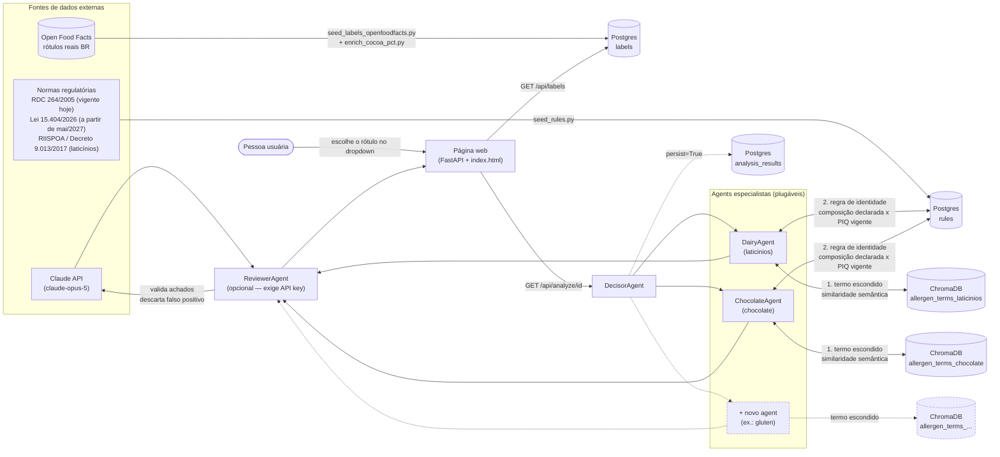

# rotulAI

Sistema **multiagent** para analisar rótulos de alimentos: identifica itens
alergênicos escondidos (nomes técnicos/disfarçados de ingredientes) e checa
se o produto cumpre as regras de identidade/composição da sua categoria
(ex.: um produto só pode se chamar "chocolate" se atingir o piso mínimo de
sólidos de cacau da norma vigente — caso contrário, precisa usar outra
denominação, como "achocolatado").

## Diagrama de arquitetura



Duas formas de rodar o pipeline hoje:
- **Página web** (`rotulai.webapp`) — escolhe um rótulo já salvo em `labels`
  num dropdown e mostra o resultado na hora (achados brutos, sem persistir
  de novo em `analysis_results`). É o jeito mais direto de explorar os dados.
- **`pipeline.analyze_label`** (usado por `main.py` e pelos scripts) — roda
  o pipeline completo (especialistas + revisor) e persiste o veredito final
  em `analysis_results`.

O pipeline tem três momentos: **1) coleta/entrada** (o rótulo chega e é
salvo em `labels`), **2) agents especialistas** (ver método detalhado
abaixo) e **3) revisão por LLM** (`ReviewerAgent`, só pra alérgeno — ver
nota no fim da seção de método).

## Método: como cada checagem funciona de fato

### É o mesmo agente que faz as duas coisas?

**Sim.** `ChocolateAgent` (`src/rotulai/agents/chocolate.py`) e `DairyAgent`
(`laticinios.py`) são só isso:

```python
@register_agent("chocolate")
class ChocolateAgent(SemanticTermAgent):
    """Detecta nomes técnicos/disfarçados de derivados de cacau/chocolate."""
```

Sem `analyze()` próprio — toda a lógica mora em `SemanticTermAgent.analyze()`
(`agents/base.py`), que roda as duas checagens abaixo, uma atrás da outra, e
devolve as duas no mesmo `AgentFinding`. **Não são dois agents nem duas
chamadas de IA** — é uma classe, um método, dois algoritmos diferentes
chamados em sequência: um busca vetorial (ChromaDB), o outro comparação
numérica direta (Postgres). Nenhum dos dois usa a Claude API.

### 1) Alérgeno escondido — busca por similaridade semântica

Não é regra fixa nem regex de sinônimo. É **busca vetorial**:

1. `split_ingredients()` quebra `ingredients_text` em itens (por vírgula/
   ponto-e-vírgula/parênteses).
2. Cada item é transformado em vetor por um modelo de embeddings
   (`all-MiniLM-L6-v2`, via `SentenceTransformerEmbeddingFunction`) e
   comparado, por **distância de cosseno**, contra a coleção da categoria no
   ChromaDB (`allergen_terms_<categoria>` — hoje só as listas placeholder em
   `data/allergen_terms/*.json`).
3. Se a similaridade do item mais próximo ≥ `SIMILARITY_THRESHOLD` (0.35 por
   padrão, `.env`), vira um `MatchedTerm` — ex.: "caseinato de sódio" bate
   com o termo conhecido "caseinato de sódio" (derivado de leite) mesmo sem
   a palavra "leite" aparecer no rótulo.
4. `hidden_allergen_detected = True` se achou pelo menos um match.

Isso é **deliberadamente permissivo** — o threshold é baixo o bastante pra
gerar falso positivo (ex.: "leite em pó" ~0.62 de similaridade com "cacau em
pó" no teste que fizemos com o Baton). É por isso que existe a etapa 3 do
pipeline: o `ReviewerAgent` chama a Claude API com esses achados brutos e
decide o que é alérgeno de verdade e o que é ruído semântico — **mas só
quando `ANTHROPIC_API_KEY` está configurada**; sem ela (como no ambiente
atual), a página mostra os achados brutos do especialista, sem esse filtro.

### 2) Regra de identidade ("é de fato chocolate?") — comparação numérica determinística

Isso **não** usa IA nem embeddings — é aritmética simples, sem ambiguidade:

1. `IdentityRuleChecker(categoria)` busca em `rules` as regras vigentes
   **na data de hoje** (`get_active_rules`, filtra por `vigente_de`/
   `vigente_ate` — é o mecanismo que faz a RDC 264/2005 valer agora e a Lei
   15.404/2026 só a partir de 2027, sem `if` nenhum no código).
2. Filtra pra regras cujo `applies_to` bate com o `declared_category` do
   rótulo (ex.: só regras de "chocolate" pra um rótulo declarado
   "chocolate" — é por isso que a ficha do `DairyAgent` não mostra nada
   sobre isso, ela não tem regra de chocolate nenhuma).
3. Pra cada regra, compara `declared_composition[campo]` contra o valor da
   regra com o operador (`>=`, `<=`, ...). Resultado: `True` (cumpre),
   `False` (viola — inclui `on_fail_denomination`, o nome que o produto
   deveria usar) ou `None` (rótulo não declarou aquele campo — **"sem dado
   pra avaliar", não "violou"**).

Como é determinístico, esse resultado **não passa pelo `ReviewerAgent`** —
não tem "interpretação" da LLM aqui, é `if observado >= esperado`. O
revisor hoje só produz veredito sobre alérgeno (`ReviewVerdict` não tem
campo de identidade) — isso é intencional (não tem ambiguidade a resolver),
mas significa que o resultado de identidade aparece "cru" na página, sem
passar por uma camada de validação adicional.

### 3) Sinal de posição do ingrediente — indício, não regra formal

Não existe, nem no Brasil nem no Codex Alimentarius/FDA, uma regra legal
que exija cacau/manteiga de cacau em posição específica da lista de
ingredientes — só existe (RDC 727/2022, Art. 11) a regra **geral**, pra
qualquer alimento, de que a lista tem que vir em **ordem decrescente de
proporção**. Isso é um indício indireto real: como cacau é caro, se ele
aparece tarde na lista é sinal de pouca quantidade — é inclusive uma dica
de consumidor comum em matérias sobre chocolate. Não é a regra legal (essa
continua sendo o percentual mínimo), mas é um sinal que dá pra calcular de
**todo** rótulo (a lista de ingredientes sempre existe; o percentual quase
nunca é declarado). `IngredientPositionChecker` calcula isso pra chocolate
(procura "cacau"/"cocoa" na lista) e mostra como aviso complementar, nunca
como PASSOU/FALHOU.

## Componentes de dados

- **ChromaDB** — base vetorial. Cada categoria de alérgeno (laticínios,
  chocolate, ...) tem sua própria coleção de termos conhecidos
  (`allergen_terms_<categoria>`), consultada por similaridade semântica.
- **Postgres**:
  - `labels` — o rótulo salvo (produto, ingredientes, denominação declarada,
    composição declarada, fonte).
  - `rules` — regras de identidade/composição (PIQ) por categoria, cada uma
    com norma de referência e vigência (`vigente_de`/`vigente_ate`) — regras
    quantitativas ("campo X >= valor Y para poder se chamar Z"), diferentes
    das regras de termo/alérgeno acima, que continuam no ChromaDB.
  - `analysis_results` — resultado final e estruturado de cada análise já
    revisada pela LLM: produto, alérgenos confirmados, confiança, raciocínio
    e os achados brutos dos especialistas (que já incluem os resultados de
    regra de identidade). É aqui que ficam os relatórios e consultas
    ("quantos produtos flagados por categoria este mês" etc.) — o ChromaDB
    não serve bem para esse tipo de consulta estruturada.
- **Agents**:
  - `DecisorAgent` — orquestra e faz o pré-filtro: se o rótulo já declara
    `declared_category` e a denominação é reconhecida (via `rules`), roda
    só o agent dono dela (ex.: "queijo" → só `DairyAgent`, sem o
    `ChocolateAgent` rodar à toa). Sem denominação reconhecida, roda todos
    os agents registrados como rede de segurança.
  - `DairyAgent` (`laticinios`) e `ChocolateAgent` (`chocolate`) — agents
    especialistas, cada um com sua coleção no ChromaDB e, via
    `IdentityRuleChecker`, com as regras de identidade da sua categoria em
    `rules`. Rodam as duas checagens (termo escondido + regra de identidade)
    e devolvem tudo em um único `AgentFinding`.
  - `ReviewerAgent` — chama a Claude API para validar os achados dos
    especialistas (descartar falsos positivos, confirmar alérgenos reais) e
    produzir o veredito final.

## Coleta de dados — de onde vem cada base

| Base | Fonte | Status | Como popular |
|---|---|---|---|
| `allergen_terms_*` (ChromaDB) | Curadoria manual | **Placeholder ilustrativo** — precisa de base curada (nutricionista/regulatório) | `python scripts/seed_chroma.py` |
| `rules` (Postgres) | Normas reais — ver detalhe abaixo | **Real**, com vigência datada por regra | `python scripts/seed_rules.py` |
| `labels` (Postgres) | [Open Food Facts](https://world.openfoodfacts.org/data) | **Real**, cobertura parcial | `python scripts/seed_labels_openfoodfacts.py` + `enrich_cocoa_pct.py` |

Não existe base pública oficial (Anvisa/MAPA) com lista de ingredientes de
rótulo por produto de marca — a maioria dos alimentos embalados é dispensada
de registro sanitário (RDC 27/2010), então esses órgãos só expõem dados
cadastrais do registro (nome, empresa, situação), não o conteúdo do rótulo.
Por isso o seed de `labels` usa o **Open Food Facts** (colaborativo, licença
ODbL — uso comercial permitido; exige atribuição e, só se a base derivada for
redistribuída publicamente, que ela também seja aberta):

1. Busca produtos brasileiros por categoria (`categories_tags` + `en:brazil`)
   na API de busca — que devolve só metadados/tags, sem o texto de
   ingredientes.
2. Para cada produto encontrado, busca o rótulo completo por código de barras
   (`ingredients_text_pt`).
3. Descarta produtos sem ingredientes preenchidos (comum — é uma base
   colaborativa e incompleta).

Limitações conhecidas dessa fonte (documentadas também na docstring do
script):
- `declared_category` é uma aproximação por categoria ampla do OFF (ex.
  `en:chocolates` → `"chocolate"`) — não confirma que o rótulo real ostenta
  aquela denominação exata.
- `declared_composition` fica **vazio**: o OFF não traz de forma confiável
  campos como "% de sólidos de cacau", então a checagem de regra de
  identidade não roda para esses rótulos até alguém completar esse dado a
  partir do rótulo real (foto/embalagem).
- Como o `id` do rótulo é derivado do código de barras
  (`openfoodfacts-<code>`), se o mesmo produto aparecer em mais de uma
  categoria buscada (ex. também listado como "dairies" genérico), a última
  categoria processada sobrescreve `declared_category` — por isso alguns
  produtos ficam com `declared_category = None` mesmo tendo entrado por uma
  busca mais específica.

## Qual regra vale hoje x qual vale a partir de 2027

O chocolate tem **duas gerações de regra** cadastradas em `rules`, cada uma
com sua janela de vigência — o sistema já resolve isso sozinho via
`vigente_de`/`vigente_ate`, sem precisar trocar código quando a data virar:

| Norma | Vigência | Chocolate | Chocolate branco |
|---|---|---|---|
| **RDC nº 264/2005 (Anvisa)** | **hoje** até 06/05/2027 | ≥ 25% sólidos totais de cacau | ≥ 20% manteiga de cacau |
| **Lei 15.404/2026** | a partir de 07/05/2027 | ≥ 35% sólidos totais de cacau (+18% manteiga, +14% isento de gordura) | ≥ 20% manteiga de cacau + 14% sólidos de leite |

Ou seja: a regra de 35% **não é usada de fato ainda** — ela já está
cadastrada porque vai passar a valer, mas o `IdentityRuleChecker`, ao
perguntar "quais regras estão ativas hoje?", recebe a RDC 264/2005. Dá pra
conferir isso rodando `get_active_rules("chocolate")` com e sem `as_of` no
futuro (ver `IdentityRuleChecker`/`get_active_rules` em
`src/rotulai/db/postgres_client.py`).

Sobre a regra "o segundo ingrediente tem que ser manteiga de cacau" —
pesquisei em mais fontes (inclusive a norma dos EUA, FDA 21 CFR 163) e
**não existe essa regra formal** em lugar nenhum. O que existe é a regra
**geral** (não específica de chocolate) de que a lista de ingredientes tem
que vir em ordem decrescente de proporção — daí a dica de consumidor comum
"prefira chocolate com cacau nos primeiros lugares da lista". É um indício
real, só que informal — modelei isso como um sinal complementar (ver
"Método" acima), não como regra de identidade.

### E iogurte x bebida láctea?

Também modelado, com norma real (MAPA, não Anvisa):

| Norma | Denominação | Regra |
|---|---|---|
| **IN MAPA nº 46/2007** | Iogurte | base láctea ≥ 51% **e** fermentação com cultura protosimbiótica específica (*S. thermophilus* + *L. bulgaricus*) |
| **IN MAPA nº 16/2005** | Bebida láctea | base láctea ≥ 51% (mesmo piso — a diferença é a composição: mistura de leite **+ soro de leite**, e não exige aquele fermento específico) |

Repare que o percentual é **igual** nas duas — a diferença entre "iogurte"
e "bebida láctea" não é quantidade, é composição/processo. Por isso a regra
do fermento está modelada como campo booleano (`fermento_especifico_presente`,
1 ou 0) em vez de um limiar numérico como os outros.

### E leite em pó / leite condensado?

Também modelado agora, por % de gordura (`gordura_pct`):

| Norma | Denominação | Faixa de gordura |
|---|---|---|
| **IN MAPA nº 53/2018** | Leite em pó integral | ≥ 26,0% |
| **IN MAPA nº 53/2018** | Leite em pó parcialmente desnatado | > 1,5% e < 26,0% |
| **IN MAPA nº 53/2018** | Leite em pó desnatado | < 1,5% |
| **IN MAPA nº 47/2018** | Leite condensado com alto teor de gordura | ≥ 16,0% |
| **IN MAPA nº 47/2018** | Leite condensado integral | ≥ 8,0% e < 16,0% |
| **IN MAPA nº 47/2018** | Leite condensado parcialmente desnatado | > 1,0% e < 8,0% |
| **IN MAPA nº 47/2018** | Leite condensado desnatado | ≤ 1,0% |

Duas ressalvas, pra não passar confiança maior do que tenho:
- Existe uma denominação opcional "semidesnatado" pro leite em pó, com faixa
  própria mais estreita dentro do intervalo "parcialmente desnatado" — as
  fontes que consultei divergiram no valor exato (12–14% vs. 14–16%), então
  **não modelei essa subfaixa** até confirmar em fonte primária (o texto
  oficial da IN 53/2018 não abriu em formato legível nas tentativas que fiz).
- O rótulo real "Leite Condensado Semidesnatado" foi mapeado pra
  `leite_condensado_parcialmente_desnatado` assumindo que "semidesnatado" é
  sinônimo comercial — a IN 47/2018 só lista 4 denominações oficiais e
  "semidesnatado" não é uma delas, então essa equivalência é uma aproximação
  linguística, não uma certeza regulatória.
- **Nenhum dos 2 rótulos reais que temos** (leite em pó, leite condensado)
  declara o % de gordura em lugar nenhum do texto — mesma limitação do
  cacau: mecanismo cadastrado e correto, mas sem dado pra avaliar de fato
  (`SEM DADO` nos dois). Testei via API pra confirmar que a regra certa é
  disparada, só não tem número real pra comparar.

## Marca (`brand`)

`labels.brand` guarda a marca do produto (ex.: "Garoto", "Nestlé",
"Itambé"). O Open Food Facts tem esse campo (`brands`), mas o seed original
não capturava — foi adicionado depois, então:
- `seed_labels_openfoodfacts.py` já captura `brands` em cargas novas.
- `backfill_brands.py` completou os rótulos que já estavam salvos,
  reconsultando cada um pelo código de barras sem tocar em mais nada
  (`declared_category`/`declared_composition` continuam intactos).
- `fix_brand_from_name.py` é uma correção manual pontual pra 3 casos em que
  o campo estruturado do OFF veio vazio, mas a marca está escrita sem
  ambiguidade no próprio nome (ex.: "LINDT Chocolate Amargo..." → Lindt) —
  não é heurística automática (extrair "primeira palavra maiúscula" geraria
  falso positivo tipo "Chocolate", "Extra"), é mapeamento explícito por id.

Resultado: **27 dos 42 rótulos reais têm marca** (KitKat → Nestlé, Talento
Dark → Garoto, Baton → Baton, Manteiga → Itambé/Tirol/Sibele, Queijo Prato
→ President, etc.). Os outros 15 continuam sem marca porque o OFF
simplesmente não tem esse dado pra eles (ex.: "Manteiga com sal" genérico,
"Queijo parmesão ralado") — mesma limitação de sempre: base colaborativa
incompleta, não um problema do nosso lado.

## Estado atual dos dados (última carga local)

**Duas coisas diferentes que fica fácil confundir: "rótulo real" ≠ "rótulo
com dado suficiente pra regra de identidade".** Todos os 42 rótulos reais
têm ingredientes de verdade e por isso **todos os 42 rodam a checagem de
alérgeno normalmente**. Só que a checagem de **identidade** (item 2 do
método acima) não usa o texto de ingredientes — usa `declared_composition`,
um campo numérico separado (`{"solidos_totais_cacau_pct": 50}`) que o Open
Food Facts não fornece pra praticamente nenhum produto. Por isso:

```
labels: 43 registros
  fonte openfoodfacts → 42 (reais — todos rodam a checagem de alérgeno)
  fonte exemplo_demo  →  1 (ilustrativo, ver abaixo)

  chocolate → 18   (4 reais + 1 ilustrativo com declared_composition — % de cacau explícito no texto)
  manteiga  → 11   (11 com declared_composition — inferido da lista de ingredientes; 1 FALHA de verdade: Qualy)
  queijo    →  3   (3 com declared_composition — inferido; todos passam)
  iogurte   →  3   (reclassificados por nome; nenhum com declared_composition — sem regra numérica pra inferir)
  leite_em_po_integral                    → 1   (reclassificado por nome; SEM DADO — não declara % de gordura)
  leite_condensado_parcialmente_desnatado → 1   (reclassificado por nome; SEM DADO — não declara % de gordura)
  (sem categoria declarada) → 6   (inclui o AdeS, que é à base de soja — fora do escopo chocolate/laticínios)

rules: 31 registros
  chocolate  → 13 (2 vigentes hoje: RDC 264/2005; 11 a partir de 2027: Lei 15.404/2026)
  laticinios → 18 (RIISPOA, IN 46/2007 iogurte, IN 16/2005 bebida láctea, IN 53/2018 leite em pó, IN 47/2018 leite condensado — todas já vigentes)
```

Ou seja: **"por que só 4 rótulos reais?" não é bem a pergunta certa** — são
42 rótulos reais, só que apenas 4 deles trazem, dentro do próprio texto, um
número que dá pra extrair (`enrich_cocoa_pct.py` procura padrões tipo "50%
cacau" ou "cocoa solids 31%"). Os outros 38 (incluindo o Baton, que você
testou) têm ingrediente real mas **não declaram** percentual em lugar
nenhum do rótulo — por isso a checagem de identidade deles dá `SEM DADO`,
corretamente, não porque falhou em achar algo que existe.

| product_name | % extraído | fonte do texto |
|---|---|---|
| Talento Dark 50% Cacau Café | 50% | nome do produto |
| LINDT ... Excellence - 70% Cacau | 70% | nome do produto |
| Chocolate Orgânico 75% | 75% | nome do produto |
| Extra Milk Chocolate | 31% | ingredients_text: "Cocoa solids 31% minimum" |

Os 4 acima **passam** na regra vigente hoje (≥25%) — é viés de sobrevivência:
fabricante só estampa o % quando é alto o suficiente pra ser argumento de
venda. Pra ter um exemplo que **falha**, adicionei 1 rótulo claramente
marcado como ilustrativo (`source="exemplo_demo"`, não é um produto real do
Open Food Facts) com 12% de cacau declarado — o mesmo papel que o "Choquito"
tinha na conversa que motivou essa checagem.

### Manteiga e queijo: dá pra avaliar sem % declarado — e achamos um caso real

Diferente do % de cacau (que só um número explícito resolve), a regra do
RIISPOA pra manteiga/queijo é **presença/ausência** de gordura ou proteína
não láctea (`<= 0%`). Isso dá pra inferir da própria lista de ingredientes,
sem precisar de percentual: como a RDC 727/2022 exige lista **completa**,
se "gordura vegetal" não aparece em lugar nenhum do rótulo, é legítimo
tratar como 0%; se aparece, é presença confirmada
(`infer_dairy_composition_from_ingredients.py`).

Rodei nos 11 rótulos reais de manteiga e 3 de queijo — **13 passam**, e
achamos **1 violação real**: "Manteiga Extra Com Sal Qualy Pote 500g" tem
como primeiro ingrediente "óleos e gorduras vegetais totalmente
hidrogenadas" — pela regra, não deveria poder se chamar "manteiga"
(deveria ser algo como "creme vegetal" ou "mistura"). Isso é um achado real
do sistema, não um exemplo ilustrativo.

"Leite condensado" e "leite em pó" agora também têm regra cadastrada (IN
47/2018 e IN 53/2018 — ver seção "E leite em pó / leite condensado?" acima),
mas nenhum dos 2 rótulos reais que temos declara % de gordura em lugar
nenhum, então ficam em `SEM DADO` (mecanismo correto, sem dado real pra
comparar). O único rótulo real que fica **de fora mesmo**, por escopo, é o
"AdeS Original" — é bebida à base de **soja**, não de leite, então não se
enquadra em nenhuma das nossas categorias de identidade
(chocolate/laticínios); ele corretamente não mostra nada ali.

Amostra de `labels` reais (marca | produto | categoria | ingredientes em português):

| brand | product_name | declared_category | ingredients_text (recorte) |
|---|---|---|---|
| Nestlé | KitKat | chocolate | AZÚCAR, LECHE EN POLVO ENTERA, LECHE EN POLVO DESCREMADA, MANTECA DE CACAO, ... |
| Garoto | Talento Dark 50% Cacau Café | chocolate | CHOCOLATE AMARGO [CACAU (MASSA DE CACAU, MANTEIGA DE CACAU, CACAU EM PÓ), AÇÚCAR, ... |
| Lindt | LINDT Chocolate Amargo Extrafino Excellence - 70% Cacau | chocolate | Massa de cacau, açúcar, manteiga de cacau, extrato de baunilha, ... |
| Baton | Baton Ao Leite | chocolate | AÇÚCAR, LEITE EM PÓ, MANTEIGA DE CACAU, MASSA DE CACAU, GORDURA VEGETAL, ... |
| Qualy | Manteiga Extra Com Sal Qualy Pote 500g | manteiga | Óleos e gorduras vegetais totalmente hidrogenadas..., água, sal, leite em pó desnatado, ... |
| Itambé | Manteiga extra sem sal | manteiga | Creme de leite |
| President | Queijo Prato Président Gran Reserva 150g | queijo | Leite pasteurizado, fermento lático, cloreto de sódio (sal), ... |
| Betânia | Leite Condensado Semidesnatado | leite_condensado_parcialmente_desnatado | Leite semidesnatado, açúcar (sacarose), lactose. |

Para reconferir esse snapshot a qualquer momento (com os containers
`docker compose up -d` no ar):

```bash
python3 -c "
from rotulai.db.postgres_client import get_session
from rotulai.db.models import LabelRecord, RuleRecord
from collections import Counter

with get_session() as s:
    labels = s.query(LabelRecord).all()
    rules = s.query(RuleRecord).all()

print('labels:', len(labels), Counter(l.declared_category for l in labels))
print('rules:', len(rules), Counter(r.category for r in rules))
"
```

## Plugando um novo agent especialista

Adicionar uma nova categoria (ex.: glúten) não exige tocar no `DecisorAgent`
nem em nenhum outro agent existente:

```python
# src/rotulai/agents/gluten.py
from rotulai.agents.base import SemanticTermAgent
from rotulai.agents.registry import register_agent

@register_agent("gluten")
class GlutenAgent(SemanticTermAgent):
    """Detecta nomes técnicos/disfarçados de derivados de glúten."""
```

Depois:
1. Criar `data/allergen_terms/gluten.json` com os termos conhecidos.
2. Rodar `python scripts/seed_chroma.py` para popular a coleção no ChromaDB.
3. Importar o módulo do novo agent uma vez no ponto de entrada (para o
   decorator `@register_agent` rodar) — ver `main.py`.

Se a detecção de um alérgeno precisar de lógica diferente de "similaridade
semântica contra uma lista de termos" (ex.: regras específicas, outro
serviço), basta herdar de `SpecialistAgent` diretamente e implementar
`analyze()` do zero — a interface é a mesma.

## Regras de identidade/composição (PIQ)

Além do alérgeno escondido, cada categoria pode ter regras de identidade —
ex.: "chocolate" exige hoje >= 25% de sólidos totais de cacau (RDC 264/2005,
sobe pra 35% em 2027 com a Lei 15.404/2026 — ver seção acima); "queijo" não
pode ter gordura não láctea (RIISPOA, Decreto 9.013/2017). Essas regras ficam
na tabela `rules` (ver
`data/rules/*.json` para as fontes exatas de cada uma) e são checadas pelo
`IdentityRuleChecker` contra o `declared_composition` do rótulo.

Três resultados possíveis por regra (`IdentityRuleResult.passed`):
- **`True`** — o valor declarado cumpre a regra.
- **`False`** — o valor declarado viola a regra (o achado inclui
  `on_fail_denomination`, a denominação que o produto deveria usar).
- **`None`** — o rótulo não declarou aquele campo em `declared_composition`;
  é "sem dado para avaliar", **não** "violou a regra" (importante: como a
  maioria dos rótulos importados do Open Food Facts não tem essa composição
  preenchida, a maior parte das checagens de identidade hoje cai aqui).

Para adicionar uma regra nova: incluir no `data/rules/<categoria>.json`
correspondente e rodar `python scripts/seed_rules.py`.

## Página web (protótipo)

`rotulai.webapp` sobe uma página simples: dropdown com os rótulos salvos em
`labels`, botão "Analisar", e o resultado do `DecisorAgent` pra esse rótulo
— por categoria, mostra os termos de alérgeno encontrados e cada regra de
identidade aplicável (com selo PASSOU/FALHOU/SEM DADO e a norma de
referência). Se `ANTHROPIC_API_KEY` estiver configurada, mostra também o
veredito final do `ReviewerAgent`; sem a chave, mostra só os achados brutos
dos especialistas com um aviso.

**Sobre o `DecisorAgent` só rodar o agent relevante**: quando o rótulo
declara uma denominação reconhecida (ex.: "queijo"), só o `DairyAgent`
roda — o `ChocolateAgent` nem é chamado, então não tem achado de chocolate
pra aparecer num queijo. Isso só relaxa pro "roda todos" quando **não** se
sabe a denominação (`declared_category` vazio) — aí sim, sem saber o que é
o produto, faz sentido checar contra todas as categorias como rede de
segurança (ex.: contaminação cruzada inesperada).

Mesmo dentro do agent certo, o selo de alérgeno ainda distingue achado
forte de fraco: como os termos ainda são placeholder e o threshold é
permissivo, às vezes aparece um match de baixíssima similaridade mesmo
dentro da categoria certa (ex.: um termo genérico batendo fraco com um
termo conhecido). **"ALÉRGENO ENCONTRADO"** (vermelho) só aparece se a
melhor similaridade for ≥ 0.5; abaixo disso, aparece **"POSSÍVEL (baixa
confiança)"** (âmbar). Isso não substitui o `ReviewerAgent` (que filtraria
isso de verdade com a Claude API), só evita que pareça mais confiante do
que é.

```bash
uvicorn rotulai.webapp:app --reload
# abrir http://127.0.0.1:8000
```

Página serve `index.html` com `Cache-Control: no-store` (protótipo em
iteração rápida — sem isso o navegador guarda a versão antiga e "some" com
mudanças recém-feitas no meio de uma sessão de testes). Se algo parecer
desatualizado (categoria errada no dropdown, seção que devia aparecer e não
aparece), primeiro tente um hard refresh (Cmd+Shift+R / Ctrl+Shift+R) antes
de assumir que é bug.

É um protótipo pra explorar os dados — não persiste nada em
`analysis_results` (isso é papel do `pipeline.analyze_label`, usado pelos
scripts) e não tem autenticação/paginação/tratamento de carga.

## Rodando localmente

```bash
cp .env.example .env        # preencher ANTHROPIC_API_KEY
docker compose up -d        # sobe ChromaDB e Postgres
pip install -e .
pip install -r requirements.txt

python scripts/seed_chroma.py   # popula os termos conhecidos (placeholder)
python scripts/seed_rules.py    # popula as regras de identidade/composição (RDC 264/2005, Lei 15.404/2026, RIISPOA, IN 46/2007, IN 16/2005, IN 53/2018, IN 47/2018)
python scripts/seed_labels_openfoodfacts.py  # rótulos reais (Open Food Facts) para testar os agents
python scripts/enrich_cocoa_pct.py            # completa % de cacau que já aparece no texto de alguns rótulos
python scripts/reclassify_iogurte.py          # marca declared_category="iogurte" pelos que já dizem isso no nome
python scripts/reclassify_leite.py            # idem pra leite em pó / leite condensado
python scripts/backfill_brands.py             # completa marca dos rótulos já salvos
python scripts/fix_brand_from_name.py         # correção manual pontual (marca óbvia no nome, campo do OFF vazio)
python scripts/infer_dairy_composition_from_ingredients.py  # infere gordura/proteína não láctea de manteiga/queijo
python scripts/seed_demo_examples.py          # 1 exemplo ilustrativo que falha a regra de identidade
python -m rotulai.main          # roda o pipeline com um rótulo de exemplo
uvicorn rotulai.webapp:app --reload  # sobe a página em http://127.0.0.1:8000
```

## Desafios do projeto

### Marcos atingidos

- Pipeline multiagent funcional: `DecisorAgent` orquestra especialistas
  plugáveis (novo agent = nova classe + decorator, sem tocar em código
  existente) que rodam duas checagens independentes cada.
- Modelo de regra de identidade **versionado por vigência** — permite ter a
  norma que vale hoje (RDC 264/2005) e a que vai valer no futuro (Lei
  15.404/2026) cadastradas ao mesmo tempo, sem `if` de data espalhado pelo
  código.
- Base de dados real: 42 rótulos de produtos brasileiros de verdade (Open
  Food Facts) e regras reais de 3 normas diferentes (RDC 264/2005, Lei
  15.404/2026, RIISPOA/Decreto 9.013/2017), carregadas em Postgres.
- Página web funcional (dropdown → análise → resultado) pra explorar tudo
  isso interativamente, não só via script/terminal.

### Dificuldades encontradas e ações tomadas

1. **Não existe base pública oficial brasileira de rótulo por produto de
   marca.** Anvisa e MAPA só expõem dados cadastrais de registro (a maioria
   dos alimentos é dispensada de registro pela RDC 27/2010) — nenhum dos
   dois tem ingrediente/composição de produto específico.
   → *Ação*: pesquisa e adoção do **Open Food Facts** como fonte de rótulo
   real, com as limitações documentadas explicitamente (cobertura parcial,
   sem campo estruturado de % de composição).
2. **Ambiguidade sobre qual norma/órgão define "o que é chocolate".** A
   suposição inicial era "regra da Anvisa" de forma genérica; a pesquisa
   revelou 3 camadas: RDC 264/2005 (Anvisa, vigente hoje), Lei federal
   15.404/2026 (substitui a RDC a partir de mai/2027) e RIISPOA/MAPA (outro
   órgão, pra laticínios).
   → *Ação*: campo de vigência (`vigente_de`/`vigente_ate`) em cada regra,
   pra representar essa transição sem lógica condicional.
3. **A API de busca do Open Food Facts não devolve o texto de
   ingredientes** — só metadados/tags normalizadas.
   → *Ação*: busca em duas etapas (busca por categoria+país pra achar o
   código de barras, depois hidrata cada produto individualmente no
   endpoint de produto, que aí sim tem `ingredients_text_pt`).
4. **% de cacau declarado não existe como campo estruturado em nenhuma
   fonte disponível** (não está na informação nutricional, que só cobre
   macronutrientes).
   → *Ação*: extração via regex do % que já aparece solto no nome/
   ingredientes de alguns produtos (`enrich_cocoa_pct.py`) + 1 exemplo
   claramente marcado como ilustrativo pra cobrir o caso "não passa" que os
   dados reais sozinhos não cobriam (viés de sobrevivência: só quem tem %
   alto anuncia no rótulo).
5. **Bug real**: campo de composição não declarado estava sendo tratado
   como "violou a regra" em vez de "sem dado pra avaliar" — descoberto
   testando o cenário de queijo com gordura vegetal.
   → *Ação*: `IdentityRuleResult.passed` virou um terceiro estado
   (`True`/`False`/`None`), não só booleano.
6. **Bug de UX, em duas partes**: primeiro, a pergunta "é de fato
   chocolate?" aparecia também na ficha do especialista de laticínios
   (descoberto testando o Talento Dark). O fix inicial comparava
   `f.category` (nome do agent — "chocolate" ou "laticinios") com
   `declared_category` (a denominação — "chocolate", mas também "queijo",
   "manteiga", "iogurte"...). Isso só funcionava pro chocolate **por
   coincidência** (lá as duas strings são iguais) — pra qualquer laticínio
   (`"laticinios" !== "queijo"`), a seção de identidade sumia de novo,
   silenciosamente. Descoberto testando queijo na página.
   → *Ação*: trocar a comparação de string por algo que reflete a
   realidade — `identity_rule_results.length > 0` (esse specialist achou
   regra de verdade pra essa denominação, então é ele quem deve responder),
   em vez de tentar casar nomes de categoria com nomes de agent.
7. **Incompatibilidade com Python 3.9**: sintaxe `X | None` em coluna do
   SQLAlchemy quebra a criação das tabelas (a lib resolve o tipo em
   runtime, e esse `|` entre tipos só existe a partir do 3.10).
   → *Ação*: `Optional[X]` explícito nos modelos ORM.
8. **Cache do navegador escondendo mudanças**: depois de reiniciar o
   servidor ou editar `index.html`, a aba já aberta continuava mostrando a
   versão antiga (categoria não reclassificada, sinal de posição ausente)
   — parecia bug de lógica, mas era só a página não ter recarregado.
   → *Ação*: `Cache-Control: no-store` na resposta de `/`, e virou hábito
   pedir hard refresh como primeiro passo de diagnóstico.
9. **`DecisorAgent` rodando todo agent em todo rótulo gerou achado confuso**:
   um iogurte mostrando "alérgeno de chocolate encontrado" por causa de
   similaridade semântica fraca (~0.38) num termo genérico ("fermento
   lácteo"), sem o `ReviewerAgent` ativo pra filtrar isso. Corrigi primeiro
   só o selo (achado forte ≥0.5 vs. "possível, baixa confiança"), mas isso
   tratava o sintoma, não a causa — foi questionado de novo (item 12) e aí
   sim resolvido na raiz: pré-filtro por categoria declarada.
10. **Regra de identidade não precisa sempre de percentual explícito**: pra
    manteiga/queijo, a regra do RIISPOA é presença/ausência (não um
    limiar numérico como o cacau) — dá pra inferir isso da própria lista
    de ingredientes (que por lei é completa), sem precisar de um dado
    externo. Isso destravou identidade de verdade (PASSOU/FALHOU, não só
    SEM DADO) pra 14 rótulos reais, incluindo achar 1 violação genuína
    ("Manteiga" Qualy, com gordura vegetal).
11. **`docker-compose.yml` montava o volume do ChromaDB no caminho
    errado**: `chroma_data:/chroma/chroma`, mas o binário do
    `chromadb/chroma` persiste de fato em `/data/chroma.sqlite3` — ou seja,
    o volume nomeado nunca guardava nada, os termos viviam só na camada
    efêmera do container. `docker compose up -d` sozinho não expõe isso
    (reaproveita o container existente), só apareceu quando o container foi
    **recriado** (`docker compose down && up`) e os termos sumiram, mas o
    Postgres continuou intacto (esse sim montado no caminho certo desde o
    início) — foi esse contraste que apontou pra causa raiz.
    → *Ação*: corrigido o mount para `chroma_data:/data`; testado com
    `docker compose down && up` de verdade (não só `restart`) pra confirmar
    que persiste.
12. **Por que o `ChocolateAgent` roda num queijo?** — questionado
    diretamente: não fazia sentido nenhum o agent errado rodar quando a
    denominação já é conhecida. Isso já estava anotado como pendência
    desde o início ("vale evoluir pra pré-filtro"), mas não tinha sido
    feito — o argumento a favor de "rodar tudo em tudo" (contaminação
    cruzada inesperada) é válido só quando **não** se sabe o que o produto
    é; quando já se sabe (`declared_category` reconhecida), rodar o agent
    errado só produz ruído.
    → *Ação*: `DecisorAgent.route()` agora consulta `rules` pra descobrir
    de qual agent é a denominação declarada e roda só ele; sem denominação
    reconhecida, continua rodando todos (rede de segurança). Testado via
    API: queijo roda só `laticinios`, KitKat roda só `chocolate`, AdeS (sem
    categoria) continua rodando os dois.

## Estado atual / próximos passos

- As listas em `data/allergen_terms/*.json` são **placeholders ilustrativos**
  — precisam ser substituídas por uma base curada quando os dados reais
  chegarem.
- A regra "OR" da categoria `achocolatado` (15% cacau OU 15% manteiga de
  cacau, Lei 15.404/2026) está modelada como duas regras independentes — o
  `IdentityRuleChecker` ainda não expressa condições alternativas/compostas.
- `declared_composition` está vazio na maioria dos rótulos do seed do Open
  Food Facts — a checagem de identidade só ganha valor prático em escala
  quando esse dado vier de uma fonte que traga a composição real de cada
  produto (rótulo fotografado/OCR, laudo, ficha técnica do fabricante); por
  ora, só os poucos rótulos que já citam o % no próprio texto foram
  completados (`enrich_cocoa_pct.py`).
- Este é um **protótipo de TCC**, não um produto: os termos de alérgeno são
  placeholder (não curados), a página web não tem autenticação, e o
  `ReviewerAgent` exige `ANTHROPIC_API_KEY` configurada pra dar o veredito
  final (sem ela, a página mostra só os achados brutos dos especialistas).
- `DecisorAgent.route()` já pré-filtra por `declared_category` quando ela é
  reconhecida (ver item 12 dos desafios); com mais agents plugados, o
  `get_category_for_denomination` continua funcionando sem alteração, já
  que ele deriva a resposta de `rules` em vez de uma lista fixa.
- Criação de tabelas via `init_db()` (`create_all`) é suficiente para este
  estágio; ao evoluir o schema em produção, trocar por Alembic.
