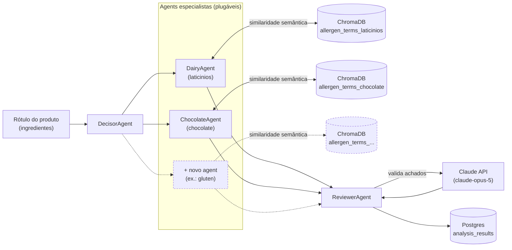

# rotulAI

Sistema multiagent para analisar rótulos de alimentos e identificar itens
alergênicos escondidos (nomes técnicos/disfarçados de ingredientes).

## Arquitetura

- **ChromaDB** — base de conhecimento vetorial. Cada categoria de alérgeno
  (laticínios, chocolate, ...) tem sua própria coleção de termos conhecidos
  (`allergen_terms_<categoria>`). Os agents especialistas consultam essas
  coleções por similaridade semântica para reconhecer nomes disfarçados nos
  ingredientes do rótulo.
- **Postgres** — armazena o resultado final e estruturado de cada análise
  (`analysis_results`): produto, alérgenos confirmados, confiança, raciocínio
  e os achados brutos dos especialistas. É aqui que ficam os relatórios e
  consultas ("quantos produtos flagados por categoria este mês" etc.) — o
  ChromaDB não serve bem para esse tipo de consulta estruturada.
- **Agents**:
  - `DecisorAgent` — orquestra: dispara todos os agents especialistas
    registrados para um rótulo e reúne os achados.
  - `DairyAgent` (`laticinios`) e `ChocolateAgent` (`chocolate`) — agents
    especialistas, cada um com sua coleção no ChromaDB.
  - `ReviewerAgent` — chama a Claude API para validar os achados dos
    especialistas (descartar falsos positivos, confirmar alérgenos reais) e
    produzir o veredito final.



## Plugando um novo agent especialista

Adicionar uma nova categoria (ex.: glúten) não exige tocar no `DecisorAgent`
nem em nenhum outro agent existente:

```python
# src/rotulai/agents/gluten.py
from rotulai.agents.base import SemanticTermAgent
from rotulai.agents.registry import register_agent

@register_agent("gluten")
class GlutenAgent(SemanticTermAgent):
    """Detecta nomes técnicos/disfarçados de derivados de glúten."""
```

Depois:
1. Criar `data/allergen_terms/gluten.json` com os termos conhecidos.
2. Rodar `python scripts/seed_chroma.py` para popular a coleção no ChromaDB.
3. Importar o módulo do novo agent uma vez no ponto de entrada (para o
   decorator `@register_agent` rodar) — ver `main.py`.

Se a detecção de um alérgeno precisar de lógica diferente de "similaridade
semântica contra uma lista de termos" (ex.: regras específicas, outro
serviço), basta herdar de `SpecialistAgent` diretamente e implementar
`analyze()` do zero — a interface é a mesma.

## Rodando localmente

```bash
cp .env.example .env        # preencher ANTHROPIC_API_KEY
docker compose up -d        # sobe ChromaDB e Postgres
pip install -e .
pip install -r requirements.txt

python scripts/seed_chroma.py   # popula os termos conhecidos (placeholder)
python -m rotulai.main          # roda o pipeline com um rótulo de exemplo
```

## Estado atual / próximos passos

- As listas em `data/allergen_terms/*.json` são **placeholders ilustrativos**
  — precisam ser substituídas por uma base curada quando os dados reais
  chegarem.
- `DecisorAgent.route()` hoje roda todos os agents em todo rótulo (só há duas
  categorias). Com mais agents plugados, vale evoluir para uma lógica de
  pré-filtro (ex.: por tipo de produto) antes de disparar todos.
- Criação de tabelas via `init_db()` (`create_all`) é suficiente para este
  estágio; ao evoluir o schema em produção, trocar por Alembic.
